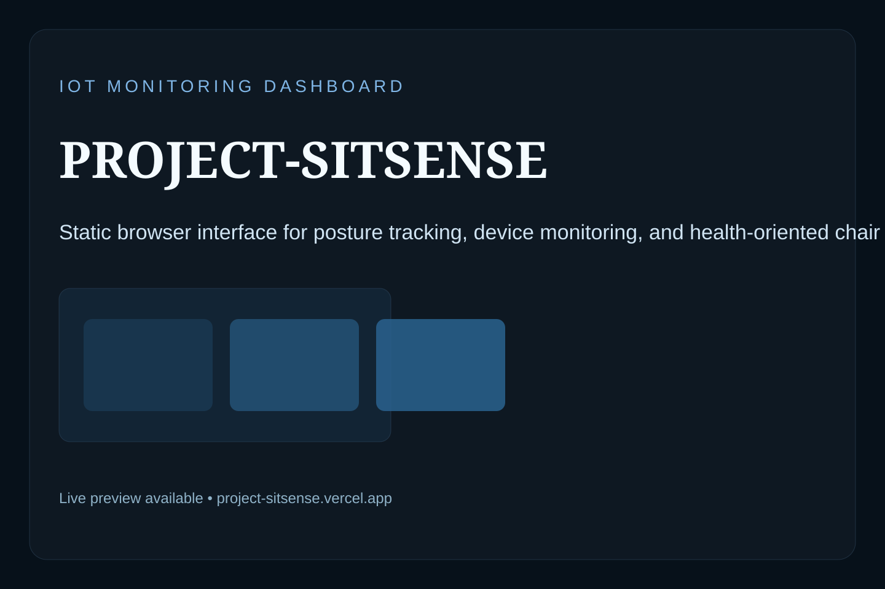

# PROJECT-SITSENSE

PROJECT-SITSENSE is a browser-based monitoring dashboard for the SitSense smart-chair concept. It presents posture tracking, sensor visualization, and interface experiments for an IoT health-monitoring workflow using static web technologies.



## Highlights

- Static dashboard UI for posture and sensor monitoring
- Multiple screens for monitoring, profile, settings, and history flows
- Asset-driven interface with reusable components and visual diagrams
- Live preview available at https://project-sitsense.vercel.app

## Tech Stack

- HTML
- CSS
- JavaScript

## Project Structure

```text
PROJECT-SITSENSE/
├── assets/
├── auth/
├── components/
├── index.html
├── home.html
├── history.html
├── settings.html
└── preview.svg
```

## Getting Started

Serve the project from the repository root so linked assets and component files load correctly.

```bash
python -m http.server 8000
```

Then visit `http://localhost:8000`.

## Live Preview

- Website: https://project-sitsense.vercel.app
- Repository: https://github.com/vaskoyudha/PROJECT-SITSENSE

## Status

This repository is maintained as a UI reference for the broader SitSense project family.
